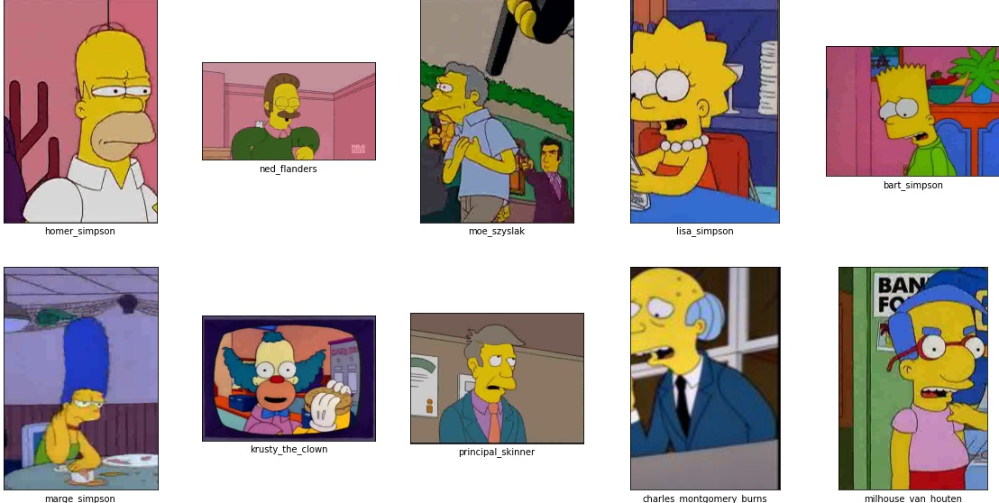
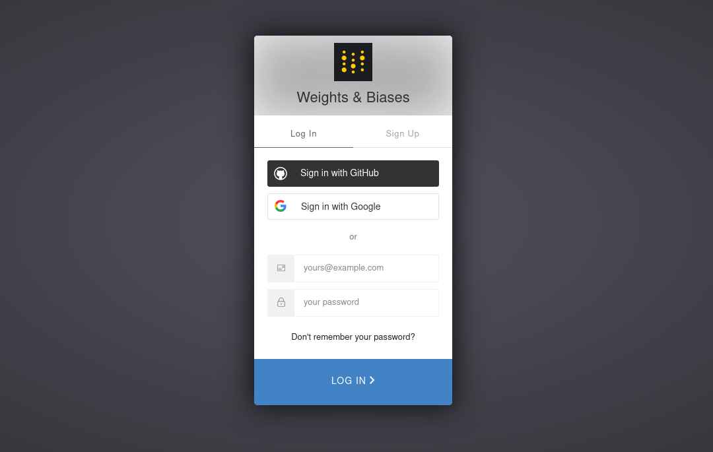
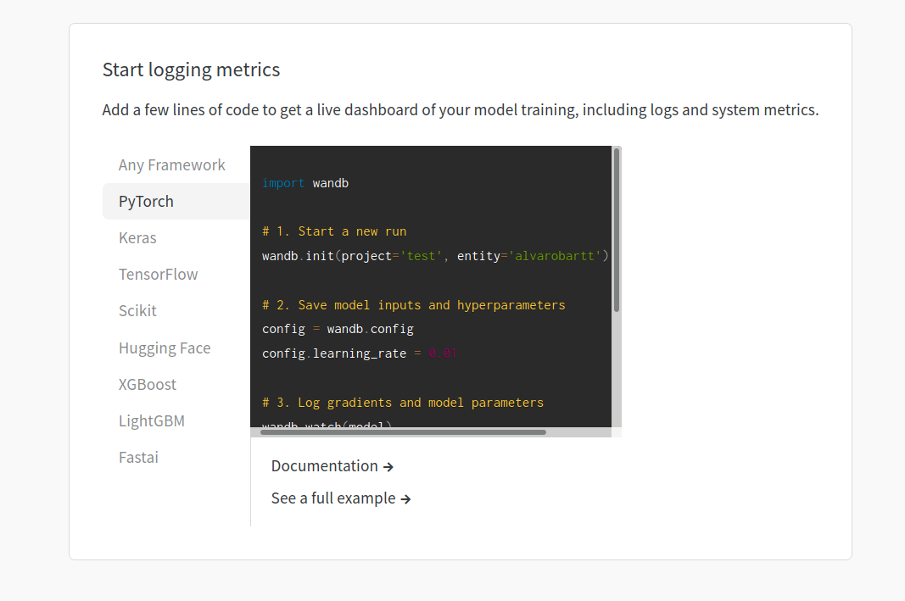
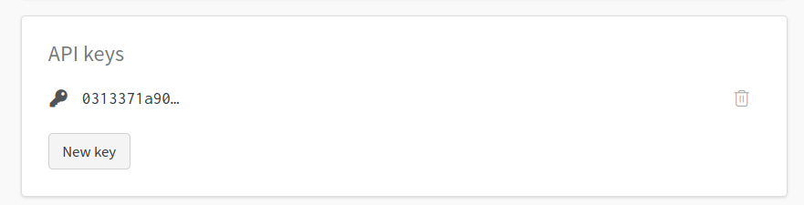
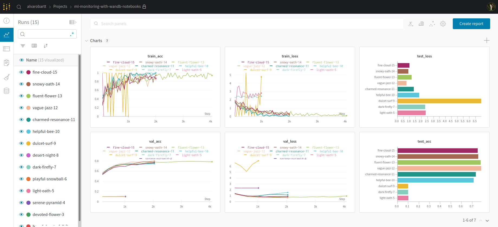

# :detective::robot: Monitoring a PyTorch Lightning CNN with Weights & Biases

__Weights & Biases__ (wandb) is the future of machine learning; tools for experiment 
tracking, improved model performance, and results collaboration. Weights & Biases helps 
you keep track of your machine learning projects, and it is framework agnostic, and environment
agnositc. Weights & Biases has a flexible integration for any Python script by simply
using the `wandb` Python library, and a few lines of code. __PyTorch Lightning__ is the lightweight 
PyTorch wrapper for high-performance AI research. Along this project we will see how to define
a PyTorch model, wrap it with PyTorch Lightning, and monitor its training with Weights & Biases.

:warning: __Disclaimer__. This project is result of some experiments I ran using `wandb`, but
it contains a lot more functionality than the one presented in this project, as this is some sort
of minimal monitoring example.

---

## :closed_book: Table of Contents

- [:hammer_and_wrench: Requirements](#hammer_and_wrench-requirements)
- [:open_file_folder: Dataset](#open_file_folder-dataset)
- [:robot: Modelling](#robot-modelling)
- [:detective: Monitoring](#detective-monitoring)
- [:computer: Credits](#computer-credits)
- [:crystal_ball: Future Tasks](#crystal_ball-future-tasks)

---

## :hammer_and_wrench: Requirements

First of all you will need to install the requirements as it follows, in order to reproduce
all the content described along this project:

```
pip install -r requirements.txt
```

:pushpin: __Note__. If you are using Jupyter Lab or Jupyter Notebooks, either on a local environment or hosted on AWS, Azure or GCP, you will 
need to install the following Jupyter Lab extensions so as to see the training progress bar in your Notebook, otherwise
you will just see a text similar to: `HBox(children=(FloatProgress(value=0.0, ...)`.

If you are using conda you will need to install nodejs first, and the proceed with the next steps. If you are not
using conda just skip this step.

```
conda install nodejs
```

And then install and activate the following Jupyter Lab widget so that you can see the tqdm progress bar properly
in your Notebook, while the PyTorch Lightning model is being trained.

```
jupyter labextension install @jupyter-widgets/jupyterlab-manager
jupyter nbextension enable --py widgetsnbextension
```

---

## :open_file_folder: Dataset

The dataset that is going to be used to train the image classification model is 
"[The Simpsons Characters Data](https://www.kaggle.com/alexattia/the-simpsons-characters-dataset)", 
which is Kaggle dataset that contains images of some of the main The Simpsons characters.

The original dataset contains 42 classes of The Simpsons characters, with an unbalanced number of samples per 
class, and a total of 20,935 training images and 990 test images in JPG format.

The modified version of the dataset, which is the one that has been used along this project, contains just the top-10
classes, and the data is balanced to have 1,000 samples per class. This results in a total of 10,000 RGB images in JPG format, 
that will be split in train/validation/test as 65/15/20. The images are then rescaled to 32x32 pixels, some of them
rotated horizontally randomlly, and then normalized.



Find all the information about the dataset in [dataset/README.md](https://github.com/alvarobartt/ml-monitoring-with-wandb/tree/master/dataset).

:pushpin: __Note__. If you want to use a similar dataset, I put together a MNIST-like The Simpsons dataset based on this
one, that you can find at [alvarobartt/simpsons-mnist](https://github.com/alvarobartt/simpsons-mnist).

---

## :robot: Modelling

Along this tutorial we will be using PyTorch Lightning as the training interface for out PyTorch model. This means
that we will first create the plain PyTorch model and its training loop, that will be later translated to PyTorch 
Ligthning.

So on, we will define a pretty simple CNN architecture for "The Simpsons Characters" dataset that we are using (the 
modified version), that consists on 32x32px RGB images, tensors of shape `(32, 32, 3)` in (H, W, C) format.

```python
import torch
import torch.nn as nn

class SimpsonsNet(nn.Module):
    def __init__(self):
        super(SimpsonsNet, self).__init__()
        self.conv1 = nn.Conv2d(3, 16, kernel_size=3, padding=1)
        self.conv2 = nn.Conv2d(16, 32, kernel_size=3, padding=1)
        self.conv3 = nn.Conv2d(32, 32, kernel_size=3, padding=1)
        self.dropout = nn.Dropout(.2)
        self.fc1 = nn.Linear(16*16*32, 128)
        self.fc2 = nn.Linear(128, 10)
        
    def forward(self, x):
        x = F.relu(self.conv1(x))
        x = F.relu(self.conv2(x))
        x = F.relu(self.conv3(x))
        x = F.max_pool2d(x, 2)
        x = self.dropout(x)
        x = nn.Flatten()(x)
        x = F.relu(self.fc1(x))
        x = self.dropout(x)
        x = F.log_softmax(self.fc2(x), dim=1)
        return x
```

Once we create the plain PyTorch model we need to intantiate the class and initialize/define both the loss function
and the optimizer that we will be using to train the net.

```python
import torch.nn as nn
import torch.optim as optim

criterion = nn.CrossEntropyLoss()
optimizer = optim.Adam(model.parameters())
```

And then we need to create the training loop, which looks like:

```python
num_epochs = 10

for epoch in range(num_epochs):
    print(f"\nEpoch {epoch}")
    running_loss = .0
    running_corrects = .0
    model.train()
    for inputs, labels in train_loader:
        inputs, labels = inputs.to(device), labels.to(device)

        optimizer.zero_grad()
        
        outputs = model(inputs)
        _, preds = torch.max(outputs, 1)
        loss = criterion(outputs, labels)
        loss.backward()
        optimizer.step()

        running_loss += loss.item() * inputs.size(0)
        res = torch.sum(preds == labels)
        running_corrects += res
    epoch_loss = running_loss / len(train_dataset)
    epoch_acc = running_corrects.double() / len(train_dataset)
    print(f"loss: {epoch_loss}, acc: {epoch_acc}")
```

That just for the training, even though we could include also the validation and the test; but that will just add
more complexity to the loop. This being said, we will proceed with the translation from plain PyTorch to PyTorch Lightning,
so that we will see how easy and structured it is to create a training interface for any model.

---

All the code above (both the net definition and the training loop) translated to PyTorch Lightning it ends up being as easy as:

```python
import torch
import torch.nn as nn
from torch.nn import functional as F

from pytorch_lightning import LightningModule
from pytorch_lightning.metrics.functional import accuracy


class SimpsonsNet(LightningModule):
    def __init__(self):
        super(SimpleNet, self).__init__()
        
        self.conv1 = nn.Conv2d(3, 16, kernel_size=3, padding=1)
        self.conv2 = nn.Conv2d(16, 32, kernel_size=3, padding=1)
        self.conv3 = nn.Conv2d(32, 32, kernel_size=3, padding=1)
        self.dropout = nn.Dropout(.2)
        self.flatten = nn.Flatten()
        self.fc1 = nn.Linear(16*16*32, 64)
        self.fc2 = nn.Linear(64, 10)
        
    def forward(self, x):
        x = F.relu(self.conv1(x))
        x = F.relu(self.conv2(x))
        x = F.relu(self.conv3(x))
        x = F.max_pool2d(x, 2)
        x = self.dropout(x)
        x = self.flatten(x)
        x = F.relu(self.fc1(x))
        x = self.dropout(x)
        x = F.log_softmax(self.fc2(x), dim=1)
        return x

    def _evaluate(self, batch, batch_idx, stage):
        x, y = batch
        out = self.forward(x)
        logits = F.log_softmax(out, dim=1)
        loss = F.nll_loss(logits, y)
        preds = torch.argmax(logits, dim=1)
        acc = accuracy(preds, y)

        self.log(f'{stage}_loss', loss, prog_bar=True)
        self.log(f'{stage}_acc', acc, prog_bar=True)

        return loss, acc
    
    def training_step(self, batch, batch_idx):
        loss, acc = self._evaluate(batch, batch_idx, 'train')
        return loss

    def validation_step(self, batch, batch_idx):
        self._evaluate(batch, batch_idx, 'val')

    def test_step(self, batch, batch_idx):
        self._evaluate(batch, batch_idx, 'test')

    def configure_optimizers(self):
        return torch.optim.Adam(self.parameters())
```

So that then, in order to train the net after defining all the steps, is just like:

```python
import pytorch_lightning as pl

trainer = pl.Trainer(gpus=1, progress_bar_refresh_rate=10, max_epochs=10)
trainer.fit(model, train_loader, val_loader)
```

So this is the basic translation from plain PyTorch to PyTorch Lightning, in the following section we will
see how easy is to integrate any logging interface to the PyTorch Lightning Trainer.

---

## :detective: Monitoring

Before starting with the ML monitoring, you will need to setup your Weights & Biases account and install 
the required Python packages so that you can dump the logs in your Weights & Biases project's page.

First you need to login to Weights & Biases at https://wandb.ai/login, where the preferred option is to 
log in using your GitHub account, so that you can synchronize both GitHub and wandb.



Once registered, you will see your main wandb page, where all your projects will be listed. If this is your first
login, you won't have any. So you should create one in order to have a proper project where you dump the logs of 
your ML model training.



So on, at the top of your Python file (.py, .ipynb) you will need to initialize wandb, so that you can properly link
your Python file with your wandb account and project. In order to do so, you just need to reproduce the steps that 
wandb showed you whenever you created the project, which in this case it should look like:

```python
import wandb

wandb.init(project='ml-monitoring-with-wandb', entity='alvarobartt')
```

The first time it may ask you for an API Key, that you can find in your profile settings on the Weights & Biases site.
The API Key section looks like the following (if you don't have any API Keys, create a new one):



Then everything will be properly set up.

---

As mentioned above, the PyTorch Lightning Trainer did not contain any logging interface defined, so that the logs
in the PyTorch Lightining module `self.evaluate()` function were just being printed locally. But if we include a custom
logger, those logging messages will be redirected.

So to update the previous training code to include Weights & Biases (`wandb`) as the custom logging interface, we just 
need to replace the Trainer code block with:

```python
import pytorch_lightning as pl
from pytorch_lightning.loggers import WandbLogger

trainer = pl.Trainer(gpus=1, progress_bar_refresh_rate=10, max_epochs=10, logger=WandbLogger())
trainer.fit(model, train_loader, val_loader);
```

Which will dump the logs to Weights & Biases, you will see both the "Project Page" and the "Run Page" when fitting the model
so that you just need to click there in order to go to https://wandb.ai/site to track your models.

After some training loops of the same model, the Weights & Biases project page looks like:



All this information is really useful as we can clearly keep track of all the experiments we run so as to keep the best model, 
depending on the feature we want to focus in.

:pushpin: __Note__. Both PyTorch Lightning and Weights & Biases log directories are included in the `.gitignore` file, which means
that the logs will not be updated to GitHub, feel free to remove those lines so that GIT does not ignore these directories.
Anyway as you are using Weights & Biases, the logs will be stored there, so there's no need to store them locally.

---

## :computer: Credits

Credits to [Alexandre Attia](https://github.com/alexattia) creating [The Simpsons Characters Dataset](https://www.kaggle.com/alexattia/the-simpsons-characters-dataset), 
as well as to the Kaggle community that made it possible, as they included a lot of manually curated images to the 
original dataset that scaled from 20 characters originally to 42.

Credits to [Lezwon Castelino](https://github.com/lezwon) for solving the PyTorch Lightning progress bar issue as he 
nicely provided a solution to the issue in [this PyTorch Lightning issue](https://github.com/PyTorchLightning/pytorch-lightning/issues/1112)
sharing the following [StackOverflow post](https://stackoverflow.com/questions/60656978/display-tqdm-in-aws-sagemakers-jupyterlab).

Last but not least, credits to [Charles Frye](https://github.com/charlesfrye) for creating and explaining in detail the integration
of Weights & Biases with the PyTorch Lightning training in the [PyTorch Lightning + W&B example](https://github.com/wandb/examples/blob/master/colabs/pytorch-lightning/Supercharge_your_Training_with_Pytorch_Lightning_%2B_Weights_%26_Biases.ipynb).

---

## :crystal_ball: Future Tasks

- [ ] Explore more wandb functionalities
- [ ] Generate reports from wandb
- [ ] Explain CPU/GPU consumption monitoring
